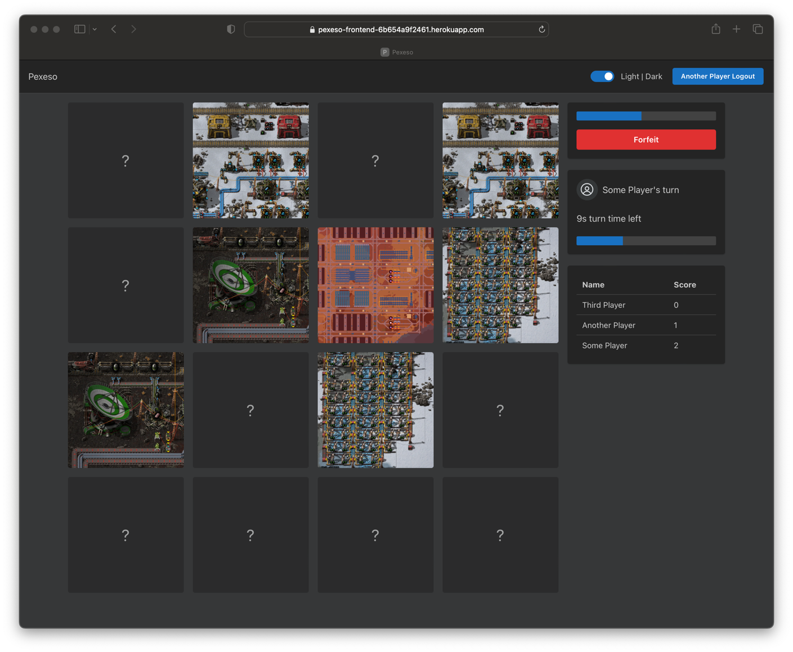

# Pexeso

## Apps

| Name             | Platform | Link                                                   |
| ---------------- | -------- | ------------------------------------------------------ |
| [API](/apps/api) | Backend  | https://pexeso-backend-c4d4378a243d.herokuapp.com/docs |
| [Web](/apps/web) | Frontend | https://pexeso-frontend-6b654a9f2461.herokuapp.com     |

## Development

This repository uses the Turbo build system. You can find more information
by [reading their documentation here](https://turbo.build/repo/docs).

- Run `yarn install` to install dependencies (yarn workspaces are used to manage dependencies across all apps)
- Run `yarn prepare:husky` to install git hooks

## Development

- `yarn lint` - lints all applications
- `yarn test` - runs all tests in parallel
- `yarn format` - formats all files using Prettier
- `yarn build` - builds all applications in parallel
