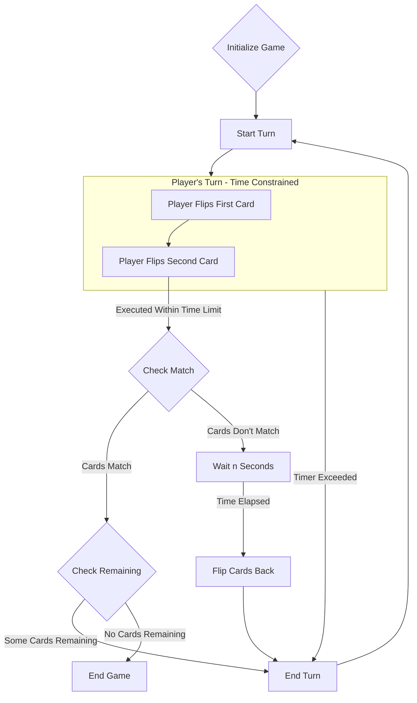
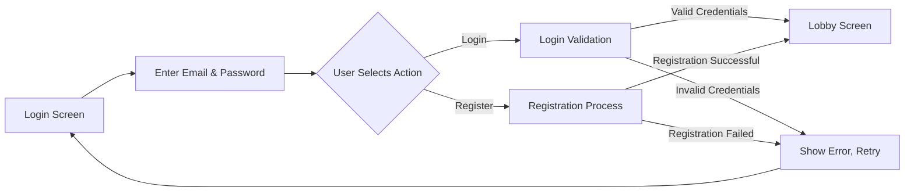
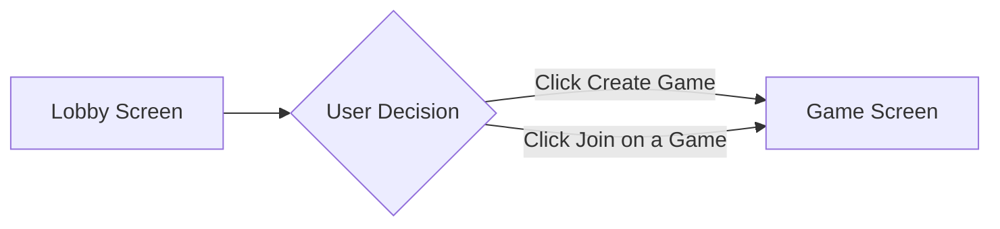
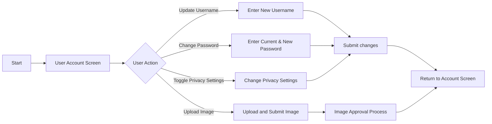

## Game Flow

```mermaid
graph TD
    A{Initialize Game}
    A --> B[Start Turn]

    subgraph T[Player's Turn - Time Constrained]
        C[Player Flips First Card]
        C --> D[Player Flips Second Card]
    end

    B --> T
    T -->|Timer Exceeded| E[End Turn]
    E --> B
    D -->|Executed Within Time Limit| F{Check Match}
    F -->|Cards Match| G{Check Remaining}
    G -->|Some Cards Remaining| E
    G -->|No Cards Remaining| H[End Game]
    F -->|Cards Don't Match| I[Wait n Seconds]
    I -->|Time Elapsed| J[Flip Cards Back]
    J --> E
```

## Login & Registration

```mermaid
graph LR
    B[Login Screen]
    B --> C[Enter Email & Password]
    C --> D{User Selects Action}
    D -->|Login| E[Login Validation]
    D -->|Register| F[Registration Process]
    E -->|Valid Credentials| G[Lobby Screen]
    E -->|Invalid Credentials| H[Show Error, Retry]
    F -->|Registration Successful| G
    F -->|Registration Failed| H
    H --> B
```

## Lobby

```mermaid
graph LR
    B[Lobby Screen]
    B --> C{User Decision}
    C -->|Click Create Game| D[Game Screen]
    C -->|Click Join on a Game| D
```

## Account Management Flow

```mermaid
graph LR
    A[Start] --> B[User Account Screen]
    B --> C{User Action}
    C -->|Update Username| D[Enter New Username]
    C -->|Change Password| E[Enter Current & New Password]
    C -->|Toggle Privacy Settings| F[Change Privacy Settings]
    C -->|Upload Image| G[Upload and Submit Image]
    D --> H[Submit changes]
    E --> H
    F --> H
    G --> K[Image Approval Process]
    H --> L[Return to Account Screen]

    K --> L
```
