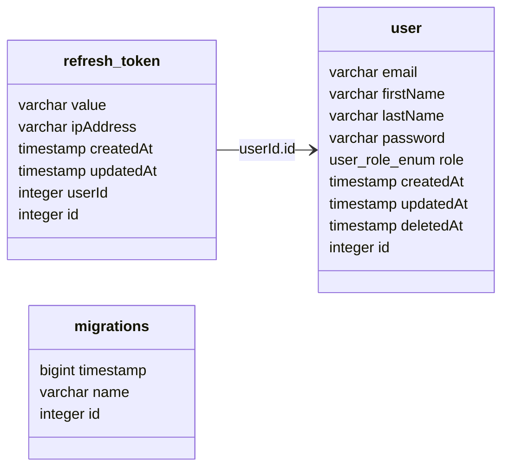

# Pexeso API

## Table of Contents

- [Setup](#setup)
- [Development](#development)
- [Database](#database)
- [Testing](#testing)

## Setup

1. Install dependencies: `make install` (the project uses [yarn](https://github.com/yarnpkg))
2. Create local environment file: `cp .env.template .env`
3. Run infrastructure `make infra` (`.db/init/init.sql` should automatically create `api_db` database)
4. Run database migrations: `make migration-run`

## Development

- `make infra` - start postgres docker container
- `make develop` - start development server
- `make type-check` - run type checking
- `make lint` - run linter

## Database

- `make seed-database` - truncate all tables and seed database with initial data
- `make migration-create name=<migration-name>` - create new empty migration file
- `make migration-generate name=<migration-name>` - generate migration file based on the current schema diff
- `make migration-run` - run all pending migrations
- `make migration-revert` - revert last migration
- `make schema-drop` - drop all tables

## Testing

Most of the tests are E2E tests, which means that they are testing the whole application, including the database. For
that.

- `make test` - run all tests
