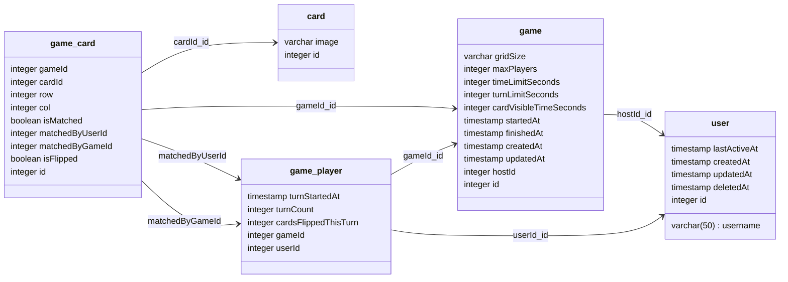

# Pexeso API

## Table of Contents

- [Setup](#setup)
- [Development](#development)
- [Database](#database)
- [Testing](#testing)

## Setup

1. Make sure you have Docker 🐳 installed and running
2. Install dependencies: `make install` (the project uses [yarn](https://github.com/yarnpkg))
3. Create local environment file: `cp .env.template .env`
4. Run infrastructure `make infra` (`.db/init/init.sql` should automatically create `api_db` database and `api_db_test` if not create manually)
5. Run database migrations: `make migration-run`
6. Run database seeds to create default pexeso cards: `make seed-database`

## Development

- `make infra` - start postgres docker container
- `make develop` - start development server
- `make type-check` - run type checking
- `make lint` - run linter
- `make format` - run prettier

## Database

- `make seed-database` - truncate all tables and seed database with initial data
- `make migration-create name=<migration-name>` - create new empty migration file
- `make migration-generate name=<migration-name>` - generate migration file based on the current schema diff
- `make migration-run` - run all pending migrations
- `make migration-revert` - revert last migration
- `make schema-drop` - drop all tables

## Testing

Most of the tests are E2E tests, which means that they are testing the whole application, including the database. For
that.

- `yarn test` - run all tests (there are some issues with makefile so it is better to run tests with yarn)
