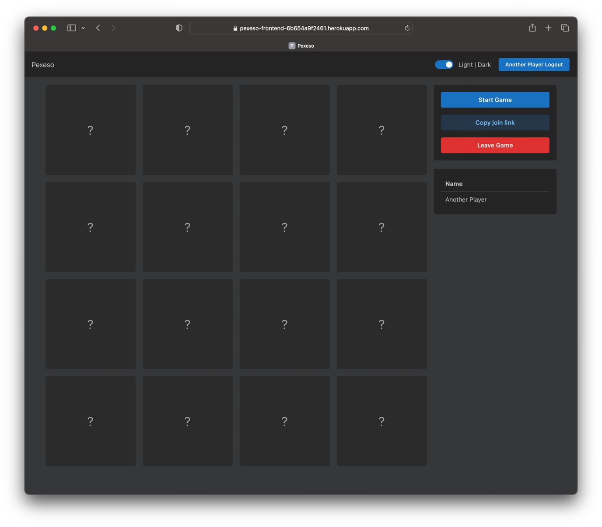
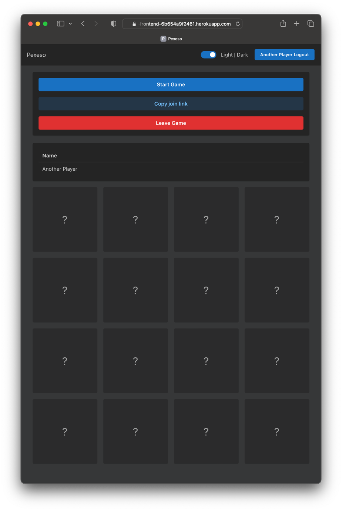

# Pexeso Web

## Table of Contents

- [Setup](#setup)
- [Development](#development)
- [Database](#database)
- [Testing](#testing)

## Setup

1. Install dependencies: `yarn install` (the project uses [yarn](https://github.com/yarnpkg))
2. Create local environment file: `cp .env.template .env.local`

## Development

- `yarn dev` - start development server
- `yarn build` - build production server
- `yarn preview` - preview production server (do not run this in actual production)
- `yarn start` - run production server
- `yarn lint` - run linter
- `yarn format` - run prettier
