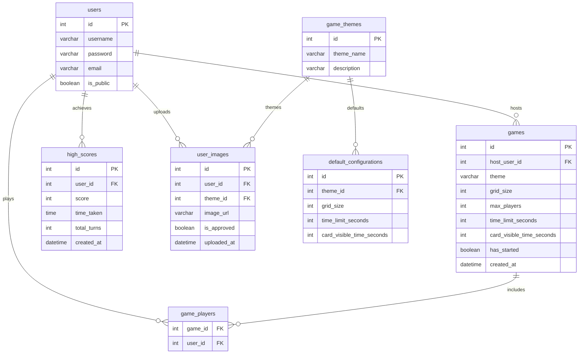

## DB Schema

```mermaid
erDiagram

    users {
        int id PK 
        varchar username 
        varchar password 
        varchar email 
        boolean is_public
    }

    games {
        int id PK
        int host_user_id FK
        varchar theme 
        int grid_size 
        int max_players
        int time_limit_seconds
        int card_visible_time_seconds
        boolean has_started
        datetime created_at
    }

    high_scores {
        int id PK
        int user_id FK 
        int score 
        time time_taken
        int total_turns
        datetime created_at
    }

    user_images {
        int id PK
        int user_id FK
        int theme_id FK
        varchar image_url 
        boolean is_approved
        datetime uploaded_at
    }

    game_themes {
        int id PK
        varchar theme_name
        varchar description
    }

    default_configurations {
        int id PK
        int theme_id FK
        int grid_size 
        int time_limit_seconds
        int card_visible_time_seconds
    }

    game_players {
        int game_id FK
        int user_id FK
    }

    users ||--o{ games : "hosts"
    users ||--o{ high_scores : "achieves"
    users ||--o{ user_images : "uploads"
    users ||--o{ game_players : "plays"
    games ||--o{ game_players : "includes"
    game_themes ||--o{ default_configurations : "defaults"
    game_themes ||--o{ user_images : "themes"
```
