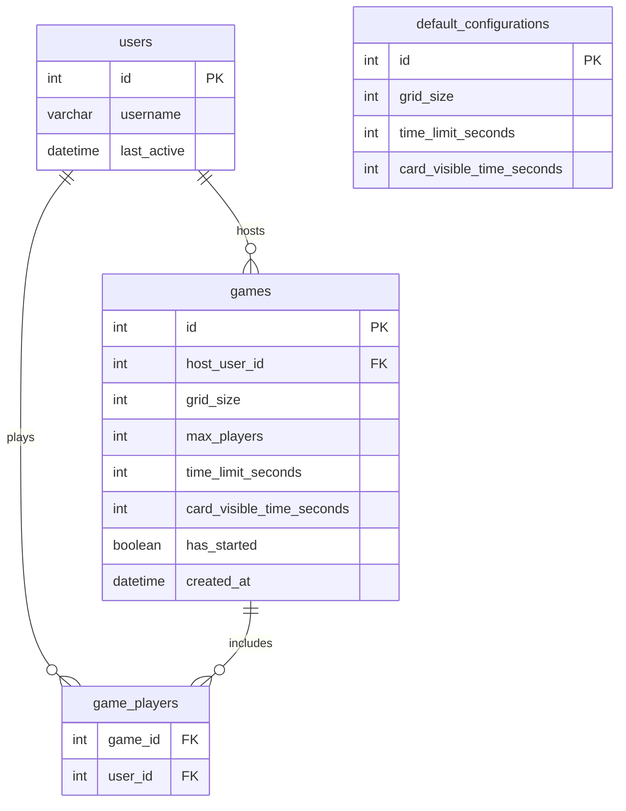

## DB Schema

```mermaid
erDiagram
    users {
        int id PK
        varchar username
        datetime last_active
    }

    games {
        int id PK
        int host_user_id FK
        int grid_size
        int max_players
        int time_limit_seconds
        int card_visible_time_seconds
        boolean has_started
        datetime created_at
    }

    default_configurations {
        int id PK
        int grid_size
        int time_limit_seconds
        int card_visible_time_seconds
    }

    game_players {
        int game_id FK
        int user_id FK
    }

    users ||--o{ games: "hosts"
    users ||--o{ game_players: "plays"
    games ||--o{ game_players: "includes"
```
